# Spacecraft Printing Mechanism – NASA Challenge Mechanism Analysis

## 1. Project Overview

This project presents the analysis and simulation of a **Spacecraft Printing Mechanism** inspired by a NASA-style advanced manufacturing challenge.

The mechanism is designed as a robotic production system capable of manufacturing large spacecraft components in a controlled and automated process. The main target of the system is the autonomous production of a **spacecraft crew module**, which is one of the most critical parts of a spacecraft structure.

The system uses multiple robotic units, rotating tables, printing arms, machining and welding arms, and a crane with magnetic clamps to move parts between manufacturing stations.

The project includes:

* Spacecraft printing mechanism definition
* Crew module manufacturing concept
* Multi-station production workflow
* Robot type identification
* CAD mechanism modeling
* MATLAB/Simulink simulation
* Degree of Freedom analysis
* Inverse kinematics application
* Dynamic motion videos
* Motion graphs and system response evaluation

---

## 2. Engineering Problem

Manufacturing large spacecraft components is complex because these structures are usually large, expensive, and difficult to transport from Earth to space.

Traditional manufacturing methods require the full structure to be produced on Earth and launched into space, which increases:

* Launch cost
* Structural limitations
* Transportation difficulty
* Assembly complexity
* Risk of damage during launch

The engineering problem in this project was:

> How can a robotic mechanism be designed and analyzed to manufacture a spacecraft crew module using automated printing, machining, welding, and transfer operations?

To solve this problem, a multi-robot spacecraft printing mechanism was developed and analyzed using CAD modeling, MATLAB/Simulink simulation, DOF analysis, and inverse kinematics.

---

## 3. My Role in the Project

My role in this project included:

* Studying the concept of robotic spacecraft manufacturing
* Defining the working principle of the Spacecraft Printing Mechanism
* Identifying the main production stations
* Analyzing the function of each robotic unit
* Preparing the CAD model of the mechanism
* Building and analyzing the MATLAB/Simulink model
* Performing Degree of Freedom calculations
* Applying inverse kinematics for robot motion control
* Studying the dynamic motion behavior of the robotic arms
* Preparing motion videos for the main mechanisms
* Analyzing position-time graphs for different robot units
* Preparing the final mechanism analysis presentation

---

## 4. Tools & Software Used

The following tools and engineering concepts were used in this project:

* **CAD Modeling** – mechanism design and visualization
* **MATLAB** – motion analysis and graph generation
* **Simulink** – system simulation and motion modeling
* **Mechanism Analysis** – studying links, joints, and motion
* **Degree of Freedom Analysis** – calculating system mobility
* **Inverse Kinematics** – determining required joint angles for a desired end-effector position
* **Robotic Arm Motion Analysis** – evaluating robot movement behavior
* **Dynamic Motion Videos** – showing mechanism operation
* **Production Line Analysis** – studying the sequence of manufacturing stations
* **PowerPoint** – preparing the final technical presentation

---

## 5. Step-by-Step Project Workflow

### Step 1: Understanding the Spacecraft Printing Concept

The project started by studying the idea of manufacturing spacecraft parts using a robotic production system.

The Spacecraft Printing Mechanism is designed to manufacture large parts in a controlled process by moving components between different production stations.

The mechanism can be used for:

* Spacecraft structure manufacturing
* Crew module production
* Modular space systems
* Large-scale automated manufacturing
* Robotic assembly and production lines

---

### Step 2: Defining the Manufacturing Target

The manufacturing target of this project is the **Spacecraft Crew Module**.

The crew module is the main body section where astronauts are located. It must provide structural protection and safety, especially during atmospheric re-entry.

The target part has a conical structure and requires high accuracy during manufacturing.

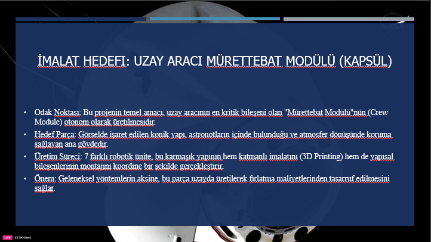

---

### Step 3: Three-Segment Inner Structure

For easier manufacturing and improved structural resistance, the inner part of the crew module was divided into three main segments.

These segments are printed sequentially by robotic printing arms and later transferred for assembly and welding.

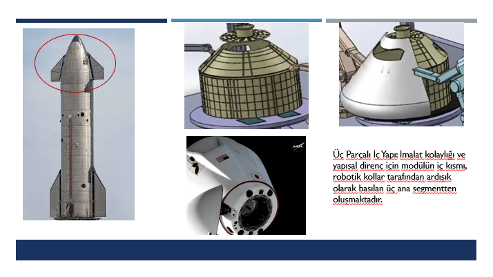

---

### Step 4: Production Station Planning

The system was divided into three main production stations.

Each station performs a different manufacturing operation.

### Station 1: Inner Structure Manufacturing

At the first station, the printing robot produces the inner body segments on a heated rotating table.

This station is responsible for the initial additive manufacturing process.

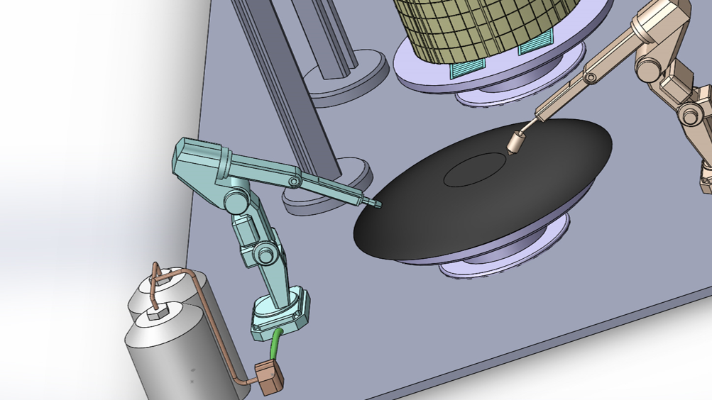

### Station 2: Transfer and Pre-Assembly

At the second station, the crane with magnetic clamps transfers the printed parts.

Machining and welding robots then perform cutting, opening, and joining operations to connect the printed segments.

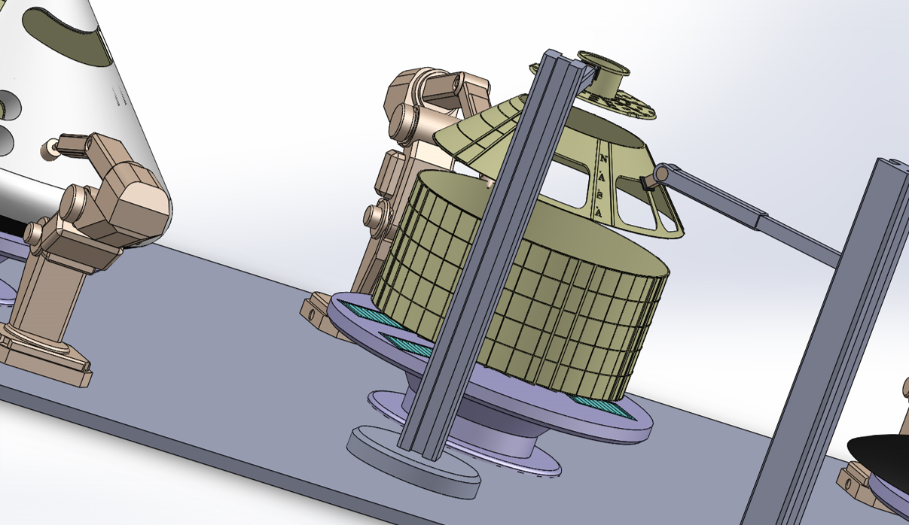

### Station 3: Outer Coating and Final Manufacturing

At the third station, additional robots perform final precision cutting and finishing operations.

The outer layer printing robot then prints the external coating of the structure to complete the spacecraft crew module.

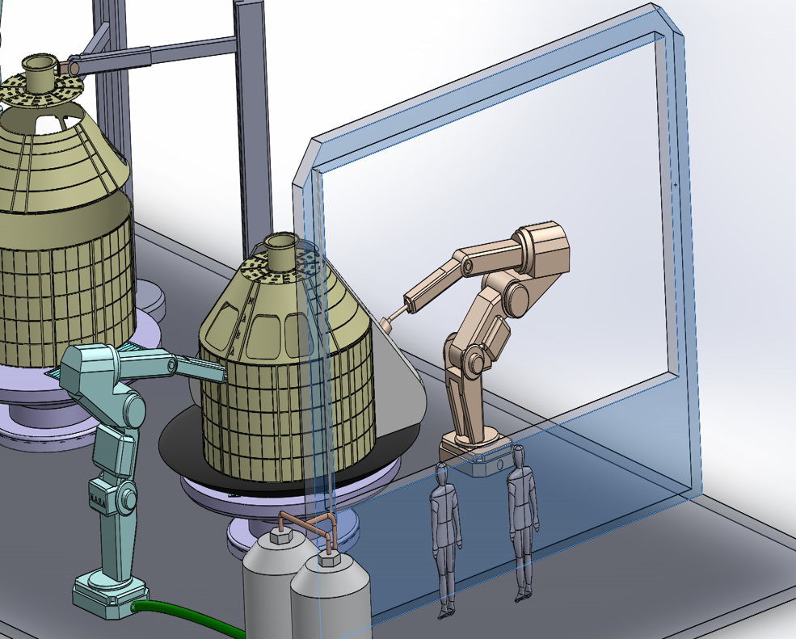

---

### Step 5: Robot Types and Production Line Flow

The mechanism includes multiple robotic units that work together in a coordinated production line.

The main robot types are:

* Printing Robot Arm
* Machining and Welding Arm
* Crane with Magnetic Clamps

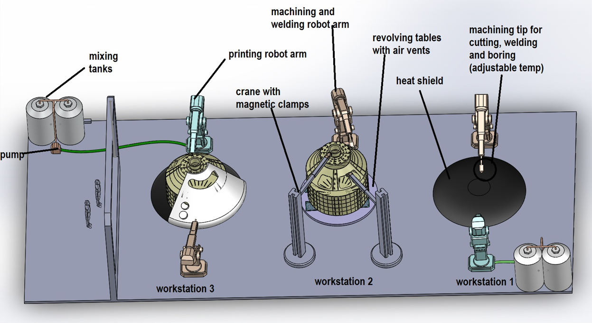

---

### Step 6: Printing Robot Arm Analysis

The **Printing Robot Arm** is one of the main motion elements of the mechanism.

It is used to perform printing operations on structural parts located on rotating tables. The rotational motion from motors is transferred through revolute joints to position the printing head in three-dimensional space.

The Printing Robot Arm contributes to:

* Additive manufacturing
* Layer-by-layer printing
* Controlled tool positioning
* Coordinated production with other robots
* Stable printing motion

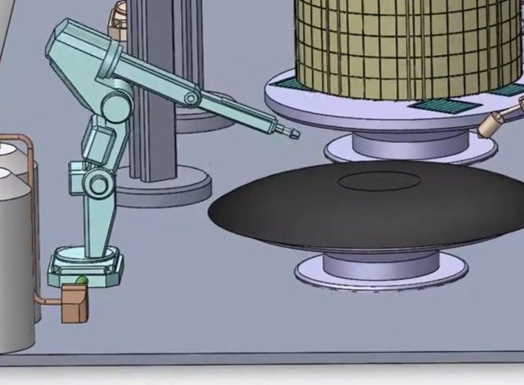

---

### Step 7: Machining and Welding Arm Analysis

The **Machining and Welding Arm** is a multi-degree-of-freedom robotic arm used for cutting, drilling, machining, and welding operations.

This robot arm is responsible for preparing and joining the printed segments.

The Machining and Welding Arm contributes to:

* Cutting operations
* Opening required holes
* Surface machining
* Welding operations
* Structural assembly
* Precision positioning

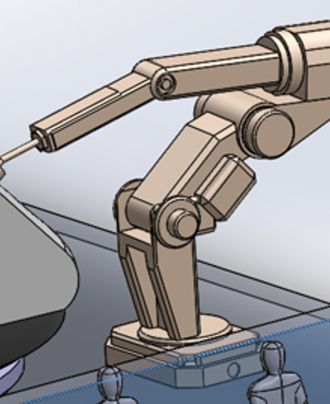

---

### Step 8: Crane with Magnetic Clamps Analysis

The **Crane with Magnetic Clamps** is used as a transfer system inside the spacecraft printing mechanism.

It uses electromagnetic clamps to hold metallic or ferromagnetic parts and safely move them between stations.

When current is applied, the magnetic clamps hold the part. When the current is removed, the part is released.

The crane contributes to:

* Part transfer
* Safe handling
* Station-to-station movement
* Automated production flow
* Controlled lifting and positioning

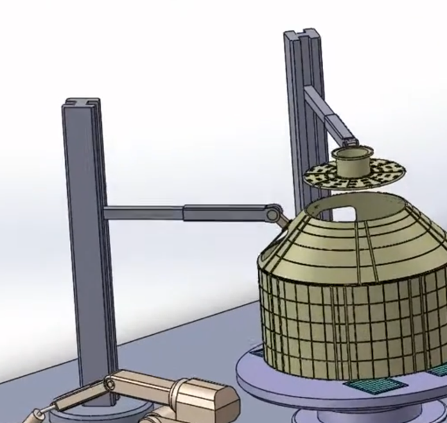

---

### Step 9: CAD Model Development

A CAD model was prepared to represent the mechanical structure of the Spacecraft Printing Mechanism.

The CAD model helped visualize:

* Robot arm placement
* Rotating table positions
* Manufacturing stations
* Transfer paths
* Overall mechanism layout
* Production line arrangement

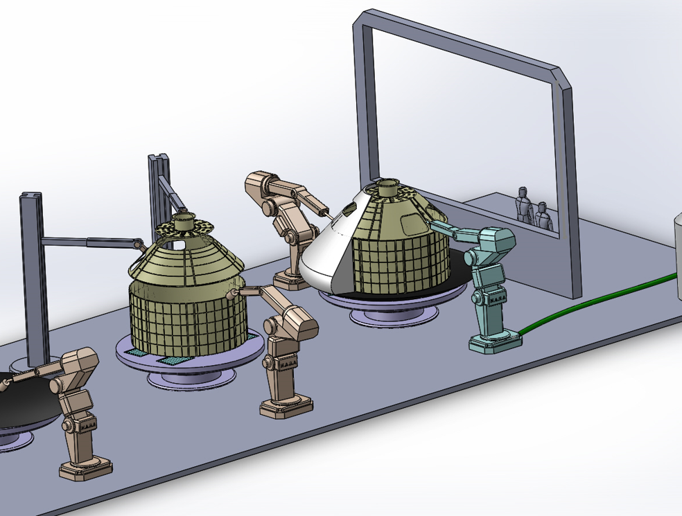

---

### Step 10: MATLAB / Simulink Model

A MATLAB/Simulink model was created to simulate and analyze the mechanism motion.

The simulation model helped study:

* Robot arm motion
* Joint behavior
* End-effector movement
* Dynamic response
* Position-time graphs
* Coordination between mechanism elements

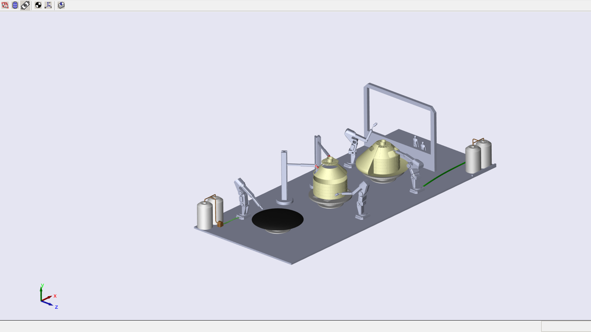

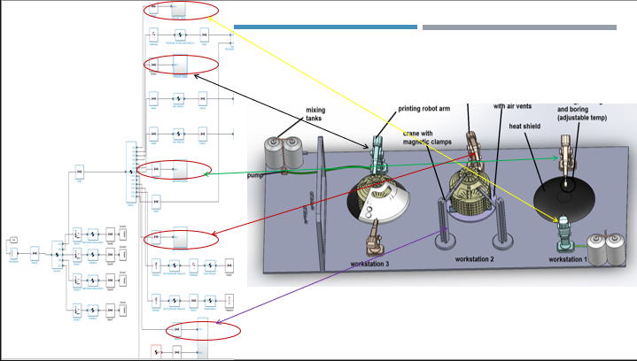

---

### Step 11: Degree of Freedom Analysis

Degree of Freedom analysis was performed using the Kutzbach criterion for planar mechanisms.

The general equation used was:

```text
F = 3(n - 1) - 2e1 - e2
```

Where:

```text
F  = Degree of Freedom
n  = Number of links
e1 = Number of one-degree-of-freedom joints
e2 = Number of two-degree-of-freedom joints
```

### DOF Calculation for Printing Robot Arm

For the Printing Robot Arm:

```text
n  = 6
e1 = 5
e2 = 0
```

Calculation:

```text
F = 3(6 - 1) - 2(5) - 0
F = 15 - 10
F = 5
```

Therefore, the Printing Robot Arm has:

```text
F = 5 degrees of freedom
```

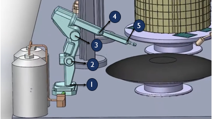

---

### DOF Calculation for Machining and Welding Arm

For the Machining and Welding Arm:

```text
n  = 5
e1 = 4
e2 = 0
```

Calculation:

```text
F = 3(5 - 1) - 2(4) - 0
F = 12 - 8
F = 4
```

Therefore, the Machining and Welding Arm has:

```text
F = 4 degrees of freedom
```

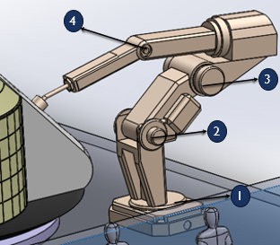

---

### DOF Calculation for Crane with Magnetic Clamps

For the Crane with Magnetic Clamps:

```text
n  = 3
e1 = 2
e2 = 0
```

Calculation:

```text
F = 3(3 - 1) - 2(2) - 0
F = 6 - 4
F = 2
```

Therefore, the Crane with Magnetic Clamps has:

```text
F = 2 degrees of freedom
```

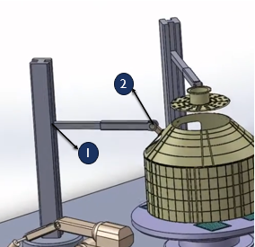

The DOF calculations show that the mechanism contains multiple controlled motion systems. This confirms the need for coordinated motion control and simulation before practical implementation.

---

### Step 12: Inverse Kinematics Application

Inverse kinematics was applied to control the motion of the robot end-effector along a required trajectory.

The desired end-effector position was defined using:

```text
X, Y, Z coordinates
```

Based on these coordinates, the required joint angles were calculated mathematically.

These joint angles were then used as motor commands in the MATLAB/Simulink model.

Inverse kinematics was important because it allowed the system to determine how each robot arm should move to reach a target position accurately.

---

### Step 13: Dynamic Motion Videos

Dynamic motion videos were prepared to show the behavior of the main robotic units.

### Printing Robot Arm Motion Video

This MP4 video shows the dynamic motion behavior of the Printing Robot Arm during the manufacturing process.

https://github.com/user-attachments/assets/YOUR-PRINTING-ROBOT-VIDEO-LINK

### Machining and Welding Arm Motion Video

This MP4 video shows the motion behavior of the Machining and Welding Arm during machining and welding operations.

https://github.com/user-attachments/assets/YOUR-MACHINING-WELDING-VIDEO-LINK

### Crane with Magnetic Clamps Motion Video

This MP4 video shows the crane motion and transfer behavior using magnetic clamps.

https://github.com/user-attachments/assets/YOUR-CRANE-VIDEO-LINK

---

### Step 14: Motion Graph Analysis

Motion graphs were generated to study the movement behavior of different robot units.

The graphs show how robot position changes with time and help evaluate the dynamic response of the mechanism.

Examples of analyzed graphs include:

* Printing Robot Arm X-position graph
* Printing Robot Arm Y-position graph
* Machining and Welding Arm Y-position graph
* Machining and Welding Arm Z-position graph
* Crane with Magnetic Clamps Y-position graph

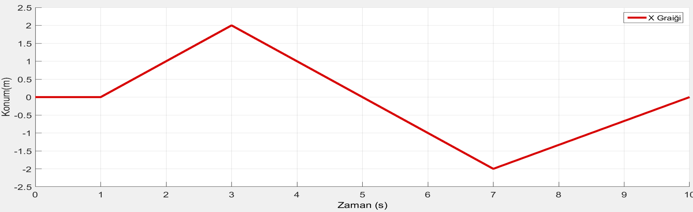

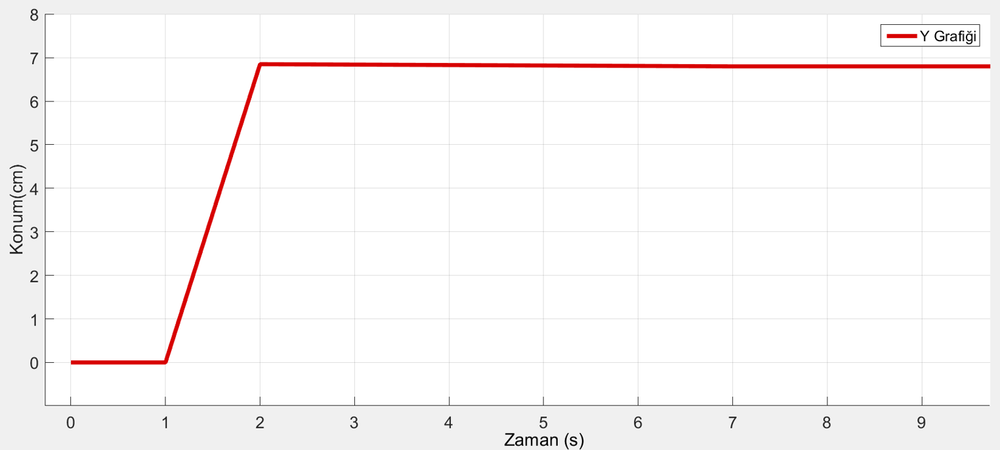

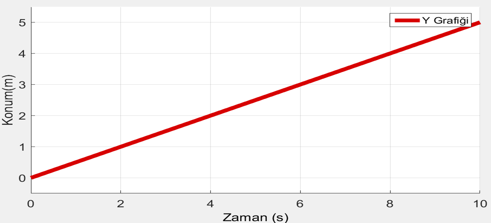

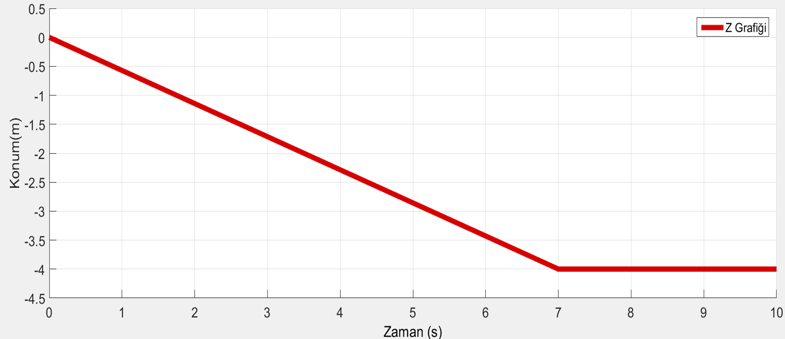

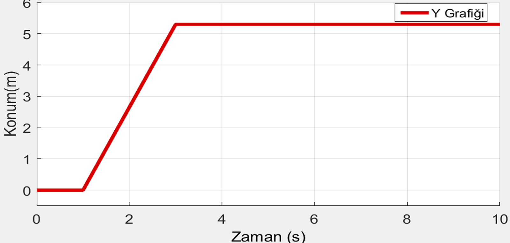

---

## 6. Engineering Analysis Performed

### Mechanism Analysis

The mechanism was analyzed as a multi-robot production system. The main mechanical elements included rotating tables, robot arms, joints, clamps, and manufacturing stations.

This analysis helped understand how the system transfers, prints, machines, welds, and finishes the spacecraft crew module.

---

### Production Line Analysis

The mechanism was divided into three production stations:

1. Inner structure manufacturing
2. Transfer and pre-assembly
3. Outer coating and final manufacturing

This production line arrangement allows the manufacturing process to be organized, sequential, and safer.

---

### Degree of Freedom Analysis

DOF analysis was performed for the main robot mechanisms using the Kutzbach criterion.

The calculated results were:

```text
Printing Robot Arm              F = 5
Machining and Welding Arm       F = 4
Crane with Magnetic Clamps      F = 2
```

These results show that the system contains multiple independent motions, making motion control and simulation essential for accurate operation.

---

### Inverse Kinematics Analysis

Inverse kinematics was applied to calculate the required joint angles needed for the robot end-effector to follow a desired trajectory.

The input position coordinates were:

```text
X, Y, Z
```

The output of the inverse kinematics process was the required joint angle values sent to the motors through the MATLAB/Simulink model.

---

### Dynamic Motion Analysis

Dynamic motion videos were used to observe the behavior of the robotic units.

The analyzed units included:

* Printing Robot Arm
* Machining and Welding Arm
* Crane with Magnetic Clamps

The videos helped demonstrate the movement of each mechanism and explain how the system operates during the manufacturing process.

---

### Graphical Motion Analysis

Position-time graphs were used to evaluate the dynamic behavior of different robot arms.

These graphs helped analyze:

* Motion response over time
* Robot arm trajectory behavior
* Directional movement in X, Y, and Z axes
* System stability during operation
* Coordination between robot units

---

## 7. Key Results / System Settings

The key results of the project were:

* A Spacecraft Printing Mechanism was defined and analyzed.
* The target manufactured part was identified as a spacecraft crew module.
* The crew module was divided into three inner structure segments.
* Three main production stations were defined.
* The main robot types were identified and explained.
* A CAD model of the mechanism was prepared.
* A MATLAB/Simulink model was created for simulation and motion analysis.
* Degree of Freedom calculations were performed for the main mechanisms.
* The Printing Robot Arm was found to have 5 degrees of freedom.
* The Machining and Welding Arm was found to have 4 degrees of freedom.
* The Crane with Magnetic Clamps was found to have 2 degrees of freedom.
* Inverse kinematics was applied to control end-effector trajectory.
* Dynamic MP4 motion videos were added for the main robotic units.
* Position-time graphs were analyzed to evaluate robot behavior.

---

## 8. Project Images and Explanation

### Spacecraft Printing Mechanism Overview

This image shows the general concept of the Spacecraft Printing Mechanism and its role in automated spacecraft component manufacturing.

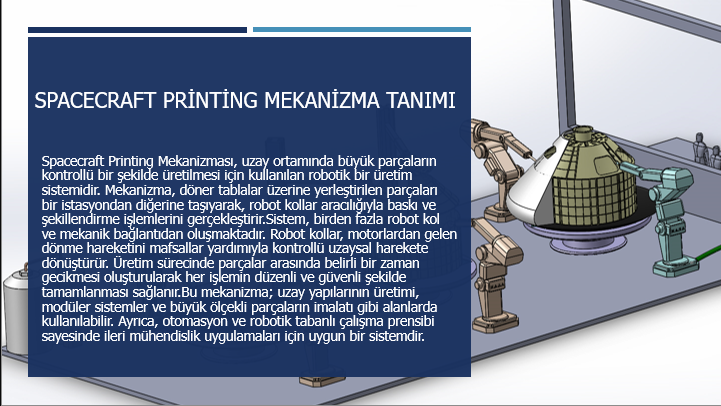

---

### Crew Module Manufacturing Target

This image shows the target spacecraft crew module structure.


---

### Three-Segment Inner Structure

This image shows the division of the inner structure into three main segments.


---

### Production Stations

This image shows the main production stations used in the mechanism.

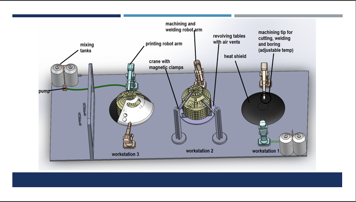

---

### Robot Types and Production Flow

This image explains the robot types used in the manufacturing line.


---

### CAD Model

This image shows the CAD model of the Spacecraft Printing Mechanism.


---

### MATLAB / Simulink Model

These images show the MATLAB/Simulink model used for mechanism simulation.


---

### DOF Analysis Images

These images show the DOF analysis of the main mechanisms.


---

### Dynamic Motion Videos

#### Printing Robot Arm Motion Video

https://github.com/user-attachments/assets/YOUR-PRINTING-ROBOT-VIDEO-LINK

#### Machining and Welding Arm Motion Video

https://github.com/user-attachments/assets/YOUR-MACHINING-WELDING-VIDEO-LINK

#### Crane with Magnetic Clamps Motion Video

https://github.com/user-attachments/assets/YOUR-CRANE-VIDEO-LINK

---

### Motion Graphs

These graphs show the time-dependent motion behavior of the robotic units.


---

## 9. Skills Demonstrated

This project demonstrates the following engineering skills:

* Mechanism analysis
* Robotic manufacturing system design
* Spacecraft manufacturing concept development
* CAD modeling
* MATLAB/Simulink simulation
* Degree of Freedom analysis
* Kutzbach criterion application
* Inverse kinematics
* Robotic arm motion analysis
* Production line planning
* Dynamic motion evaluation
* Position-time graph interpretation
* Automation system understanding
* Technical engineering presentation

---

## 10. Project Files

The repository contains the following files:

```text
docs/
└── Spacecraft-Printing-Mechanism-Presentation.pptx

images/
├── spacecraft-printing-overview.png
├── crew-module-target.png
├── three-segment-inner-structure.png
├── mechanism-motion-simulation.png
├── production-stations.png
├── inner-structure-manufacturing-station.png
├── transfer-and-pre-assembly-station.png
├── outer-coating-final-station.png
├── robot-types-production-flow.png
├── printing-robot-arm.png
├── machining-welding-arm.png
├── crane-magnetic-clamps.png
├── cad-model.png
├── matlab-simulink-model-1.png
├── matlab-simulink-model-2.png
├── dof-printing-robot-arm.png
├── dof-machining-welding-arm.png
├── dof-crane-magnetic-clamps.png
├── printing-robot-x-graph.png
├── printing-robot-y-graph.png
├── machining-welding-y-graph.png
├── machining-welding-z-graph.png
└── crane-y-graph.png

videos/
├── printing-robot-arm-motion.mp4
├── machining-welding-arm-motion.mp4
└── crane-magnetic-clamps-motion.mp4

matlab/
├── spacecraft_printing_model.slx
├── inverse_kinematics_model.m
├── printing_robot_analysis.m
├── machining_welding_arm_analysis.m
└── crane_motion_analysis.m
```

---

## 11. Conclusion

This project successfully presents the analysis of a NASA-inspired Spacecraft Printing Mechanism for automated spacecraft crew module manufacturing.

The system combines robotic printing, machining, welding, part transfer, CAD modeling, MATLAB/Simulink simulation, DOF analysis, inverse kinematics, motion videos, and position-time graph evaluation.

The DOF analysis showed that the main mechanisms have multiple degrees of freedom, including 5 DOF for the Printing Robot Arm, 4 DOF for the Machining and Welding Arm, and 2 DOF for the Crane with Magnetic Clamps.

The inverse kinematics analysis helped determine the required joint angles for reaching desired end-effector positions. The motion graphs and dynamic videos helped evaluate how the robot units behave during operation.

This project demonstrates practical understanding of mechanism analysis, robotics, automated manufacturing, simulation, spacecraft production concepts, and engineering system evaluation.
